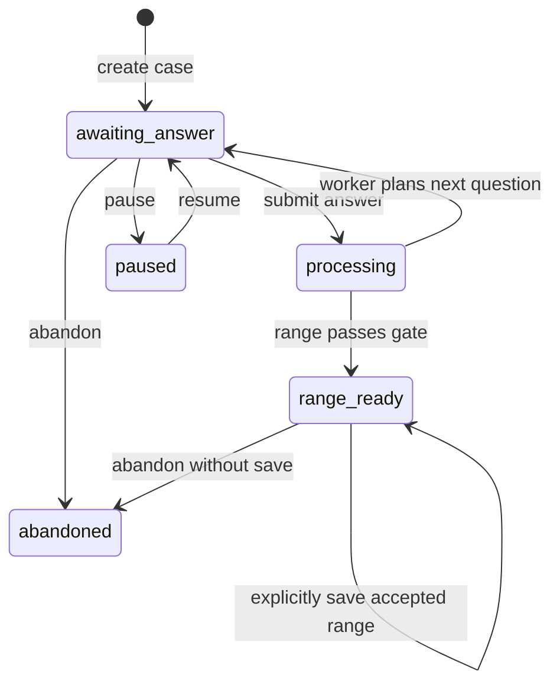

# 生时校正 V4 重构设计 — 2026-07-26

## 1. 结论

生时校正不应继续作为“聊天接口里顺便跑一次模型和分钟扫描”的功能维护。V4 将它重构为独立、可恢复、可审计的证据工作流：

1. 先收集跨领域、带日期精度的人生事件；
2. 再对已经存在但日期较粗的事件做定向修订；
3. 后台 Worker 对冻结的计算口径和证据集合评分；
4. 只输出通过稳定性门槛的候选时间范围；
5. 用户主动保存后，才把该范围交给原咨询问题继续使用。

产品永久边界：**V4 不确认单分钟，不把峰值分钟显示为真实出生时间，不修改 `profiles.active_birth_time`。**

本文记录已经落地到本地可测试工作树的目标架构，而不是对旧实现的小修补。

## 2. 交互记录暴露的旧架构问题

用户提供的 Agent 交互记录说明，专业校时需要的不只是一个聊天框，而是一套持续数十轮仍保持一致的证据系统。旧 Web 流程无法稳定复现该过程，主要原因不是文案不够像 Agent，而是职责没有拆开。

### 2.1 预设年份问卷替代了真实证据

旧流程先给出宽年份选项，再不断要求把同一事件从年份段缩到年份、季度、月份。这样会产生三个问题：

- 问题本身暗示事件应该发生在哪个窗口，带来确认偏差；
- 用户已经给过事件后，系统仍可能把它当成下一条新事件；
- 为了进入评分而取区间中点，会制造不存在的日期精度。

V4 改为先接收用户自己声明的事件和日期，再把后续日期补充写成同一事件的新 revision。

### 2.2 对话、抽取、评分和结果表达在同一请求中耦合

旧流程把事件抽取、技术计算、叙事生成和下一题规划放在一个请求生命周期里。任一模型超时、跨语言 schema 漂移或计算耗时，都可能让已提交的经历看起来没有保存。

V4 的同步请求只负责持久化答案并创建 Job；Worker 异步完成抽取、评分、稳定性检查和下一题规划。用户提交成功后可以离开页面，稍后继续。

### 2.3 “第一名分钟”被误当成产品答案

分钟扫描必然会产生一个最高分，但最高分不等于真实出生分钟。旧交互即使同时声明低置信度，仍会把一个具体分钟写成“建议暂用时间”，视觉上压过候选范围和不确定性说明。

V4 将 `representativeTime` 限定为内部聚类数据。公开快照中的 `canConfirmExactMinute` 是字面量 `false`；UI 只显示 `startTime–endTime`，不显示峰值分钟。

### 2.4 没有稳定的事件身份和修订链

用户可能先说“某年发生”，后续补成“某年某月”，也可能纠正原先年份。覆盖旧记录会丢失审计信息；新建一条记录又会重复计分。

V4 使用 `eventId + revision`：

- `eventId` 表示同一人生事件；
- 每次补充创建 append-only revision；
- `supersedesRevisionId` 指向上一版本；
- 评分只读取每个 `eventId` 的最新 revision。

### 2.5 会话状态不足以承担业务状态

浏览器会话可能被删除、刷新或从另一设备继续。旧流程把关键进度附着在聊天消息上，难以保证幂等、恢复、并发提交、扣费和原问题 handoff。

V4 将 Case、Turn、Event Revision、Snapshot、Job 和 Handoff 独立持久化；聊天会话只是入口和展示容器，不再是生时校正业务真源。

## 3. 产品合同

### 3.1 输入

- 已保存出生日期；
- 用户声明的候选时间和不确定范围；
- 出生地点坐标与时区；
- 固定计算口径：Lahiri、Mean Node、一分钟步长；
- 用户主动提供的人生事件。

### 3.2 证据领域

| 领域 | 典型事件 | 评分状态 |
| --- | --- | --- |
| `education` | 升学、复读、毕业、转学 | scoreable |
| `relocation` | 搬家、长期迁居、离乡 | scoreable |
| `relationship` | 重要关系开始或结束 | scoreable |
| `career` | 入职、离职、转行、职责突变 | scoreable |
| `finance` | 收入、负债、资产明显变化 | scoreable |
| `health_pressure` | 疾病、手术、事故、长期压力起点 | scoreable |
| `family` | 家庭结构或亲属重大事件 | context-only |
| `other` | 其他明确、重要、可核对事件 | 按领域能力决定 |

家庭事件先保留为上下文，不应为了“凑够领域”接入没有可靠 scorer 的技术层。

### 3.3 输出

- 一个主要候选范围；
- 可选的次级候选范围；
- 支持该范围的事件；
- 冲突或区分力不足的事件；
- 稳定性门结果；
- 用户是否已主动保存该范围。

### 3.4 永久禁止

- 不确认单分钟；
- 不把 `representativeTime` 作为公开结论；
- 不自动保存候选范围；
- 不修改 `profiles.active_birth_time`；
- 不因聊天文案或模型失败丢弃已经持久化的答案；
- 不用区间中点伪造事件日期；
- 不把同一事件的日期补充重复计分。

## 4. 两阶段问题规划

### 4.1 阶段一：领域覆盖

按低回忆成本优先收集七个领域。每次只问一个开放问题，要求用户自己提供事件与尽可能准确的年月，不先展示系统猜测的年份窗口。

当前确定性顺序为：

```text
education → relocation → relationship → career → finance → health_pressure → family
```

规划器已经保留 `candidateSplitByDomain` 输入；未来只有当评分引擎能给出可解释的领域区分力时，才允许在不增加模型自由度的前提下动态排序。

### 4.2 阶段二：日期精度修订

完成领域覆盖后，对最新 revision 仍不是 `day` 精度的 scoreable 事件定向追问：

- 问题保存 `targetEventId`；
- Turn 保存 `questionTargetEventId`；
- Worker 用该 ID 将回答追加到原事件；
- 如果回答没有可解析日期，不创建伪 revision；
- 已经追问过或用户跳过的事件写入尝试集合，不循环追问。

如果所有可修订事件都已处理但仍未通过稳定性门，则询问新的、日期明确的重要事件；用户可以暂停或结束。

## 5. 状态机

### 5.1 Case 状态



| 状态 | 含义 | `currentQuestion` |
| --- | --- | --- |
| `awaiting_answer` | 等待用户回答 | 必须非空 |
| `processing` | 答案已保存，后台处理中 | 空 |
| `range_ready` | 有候选范围；可能尚未保存 | 可空；稳定范围就绪时为空 |
| `paused` | 用户主动暂停 | 保留可恢复进度 |
| `abandoned` | 用户结束本次校正 | 空 |

关键不变量：证据不足时必须生成下一题，不能出现 `status=awaiting_answer` 且 `currentQuestion=null`。

### 5.2 Worker 阶段

```text
extracting_evidence
  → scoring_candidates
  → checking_robustness
  → planning_question
  → collecting_evidence | complete
```

Case 状态描述用户能做什么，Phase 描述系统正在做什么。两者不能混用。

### 5.3 Job 状态

```text
pending → processing → completed
                  └→ failed
pending/expired processing → processing by another worker
obsolete input → stale
```

Job 使用十分钟 lease。只有持有有效 lease 且输入 case version、证据 hash、计算口径 hash 仍匹配的 Worker 可以完成任务。

### 5.4 Handoff 状态

```text
pending → claimed → executing → consumed
```

过期的 `claimed/executing` lease 可恢复为 `pending`。Handoff 使用 `requestId`、`claimActionId` 和 settlement receipt 保证多设备重试不会重复执行或重复扣费。

## 6. 数据模型

### 6.1 Case

Case 冻结一次校正的业务口径：

- `calculationSpec`；
- `calculationSpecHash`；
- `evidenceSetHash`；
- `version`；
- `currentQuestion`；
- `latestSnapshot`；
- `acceptedRange`。

`acceptedRange` 在用户点击“保存这个范围”前始终为 `null`。

### 6.2 Turn

Turn 是用户回答的不可变输入记录：

- 本轮问题 ID、领域和目标事件 ID；
- 可见问题文本；
- 用户原始回答；
- `actionId`；
- 提交时的 case version。

失败重试时可以恢复同一个问题，不需要从聊天文本反向猜测当时问了什么。

### 6.3 Event 与 Event Revision

Event 提供稳定身份；Revision 保存领域、事件类型、摘要、原文、日期范围、精度和评分资格。

评分前执行 `latestEventRevisions()`，确保同一事件只使用最新版本。原始回答保留，技术评分不依赖经过润色的叙事文案。

### 6.4 Candidate Snapshot

每次评分都生成不可变 Snapshot：

- 输入证据 hash；
- 计算口径 hash；
- 算法版本；
- 全部分钟候选分数；
- 候选聚类；
- 稳定性结果；
- 决策门原因。

Snapshot 使刷新、复算和算法升级可审计，不用覆盖上一轮结果。

## 7. 候选聚类与稳定性门

### 7.1 聚类

当前算法取峰值分数的相对 `0.97` 以上候选，将相邻分钟合并为 cluster，并按峰值和 score mass 排序。

`representativeTime` 仅用于内部描述 cluster 峰值。公开结果使用 `startTime` 和 `endTime`。

### 7.2 可保存范围门槛

主要范围必须同时满足：

- 至少 5 个 scoreable 事件；
- 至少 3 个 scoreable 领域；
- cluster 宽度至少 2 分钟，拒绝单分钟结果；
- cluster 宽度不超过 15 分钟；
- 邻近分钟支持至少 2 分钟；
- leave-one-out 保留率至少 0.8；
- 日期敏感性保留率至少 0.8；
- 计算口径 hash 与建案时一致。

无论是否通过，`canConfirmExactMinute` 永远为 `false`。

## 8. 请求与后台执行边界

### 8.1 同步 API 负责

- 认证和输入校验；
- 幂等 action；
- optimistic case version 检查；
- 保存 Turn；
- 创建 pending Job；
- 返回 `202` 和可轮询 Job。

### 8.2 Worker 负责

- 抽取新事件或定向修订；
- 计算 evidence hash；
- 调用 Python 候选引擎；
- 聚类与稳定性门；
- 生成 Snapshot；
- 规划下一题；
- 原子完成 Job 和 Case 状态迁移。

非关键叙事模型不在 V4 完成链路上。确定性问题和业务状态在模型不可用时仍可继续。

## 9. 数据库不变量

迁移 `20260726020000_birth_time_rectification_v4.sql` 将关键规则下沉到 PostgreSQL：

1. 同一用户最多一个未结束、未接受范围的活动 Case；
2. `actionId` 幂等，同一 action 不能绑定不同问题；
3. `expectedCaseVersion` 不匹配时拒绝陈旧写入；
4. 未通过快照门或范围与最新主要 cluster 不一致时不能保存；
5. 有效 Worker lease 不能被抢占，过期 lease 可以接管；
6. Worker 只能完成仍匹配输入 hash 和 version 的 Job；
7. Handoff claim、begin、refund 和 settlement 可重试；
8. 一次 Handoff 最多产生一次成功扣费；
9. 取消的请求可以重新生成 request key；
10. 整个 V4 migration 不更新 `profiles.active_birth_time`。

## 10. UI 设计

### 10.1 首屏

必须同时告诉用户：

- 正在比较的声明候选边界；
- 当前流程先核对经历；
- 结果只会是候选范围，不是已确认分钟；
- 原咨询问题已保留。

### 10.2 处理中

提交后立即显示“回答已经保存，计算在后台继续”。允许用户离开页面，不用让浏览器请求一直等待。

### 10.3 日期修订

日期修订问题必须有可见 label 和输入框，不得只显示空卡片。问题明确允许“不记得/跳过”，避免为了通过流程而编造日期。

### 10.4 结果

只显示：

- 主要/次级候选范围；
- 支持经历；
- 冲突或区分力不足；
- 不确定性说明；
- “保存这个范围”操作。

不显示内部事件 ID、hash、技术 packet、模型错误、评分明细或峰值分钟。

### 10.5 保存与继续咨询

点击“保存这个范围”只写 `acceptedRange`。之后用户可以把该范围带回原问题；咨询服务将其作为“未验证候选范围”使用，而不是已确认出生时间。

## 11. 错误与恢复策略

- 输入不合法：同步返回稳定中文错误，不创建 Job；
- 陈旧版本：返回冲突，客户端刷新 Case；
- Worker 失败：Job 标记 failed，恢复原问题；
- Worker 崩溃：lease 到期后其他 Worker 接管；
- 证据不足：生成下一题，不伪装成技术异常；
- 用户暂停：保留 Case、事件和问题；
- 用户结束：Case 进入 abandoned，出生资料不改写；
- 页面刷新：从活动 Case、Job 和事件台账恢复；
- 多设备 handoff：由数据库 lease 和 settlement receipt 仲裁。

## 12. 已落地代码边界

```text
frontend/src/lib/rectification-v4/          领域模型、规划、评分适配、Store、Worker
frontend/src/app/api/rectification/v4/     HTTP API
frontend/src/components/rectification-v4-panel.tsx
frontend/src/hooks/use-rectification-v4.ts
frontend/scripts/rectification-v4-worker.mts
scripts/active_rectification_events_v4.py
frontend/supabase/migrations/20260726020000_birth_time_rectification_v4.sql
frontend/tests/rectification-v4-*.test.ts
tests/test_active_rectification_events_v4.py
```

首页旧聊天入口继续保留外壳和历史兼容，但新的活动流程由 `RectificationV4Panel` 和 V4 API 驱动。

## 13. 本地验收结果

截至 2026-07-26：

- 前端 V4、handoff、replay、consultation continuation：33 个测试通过；
- Python 引擎：2 个测试通过；
- 目标 ESLint：通过；
- `npm run build -- --webpack`：通过，27 个页面生成成功；
- PostgreSQL：12 项迁移和并发/扣费不变量通过；
- 真实 PostgreSQL + Python Engine E2E：最终进入 `range_ready`，主要范围 `05:26–05:30`；
- E2E 后 `active_birth_time` 保持原值，`acceptedRange` 保持空值；
- 静态浏览器预览：日期修订输入框、范围保存按钮、不确认分钟文案和 390px 无横向溢出均通过。

本轮没有提交、推送或部署。由于当前本地认证浏览器与隔离 V4 数据库/服务环境没有安全地连在一起，尚未声称“真实登录态端到端 UI”已验收；发布前仍需在正确的本地或 staging 认证环境执行一次完整用户操作 smoke。

## 14. 发布前必须补齐

1. 应用迁移并核对 migration ledger；
2. 启动独立 Worker，确认部署环境包含数据库和 Python API 配置；
3. 用测试账户完成：建案 → 七领域 → 日期修订 → 范围就绪 → 主动保存 → 原问题 handoff；
4. 证明刷新和另一设备可恢复；
5. 证明重复提交、过期版本和 Worker 接管不重复事件、不重复扣费；
6. 再次核对 `profiles.active_birth_time` 未被 V4 路径更新；
7. 将验收绑定到精确部署 Git SHA，而不是只看 HTTP 200。
