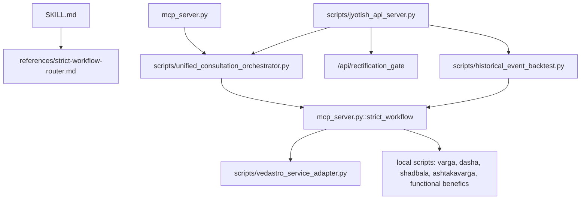

# Unique Main Chain Map

Date: 2026-07-01

This is the single current map for the Jyotish runtime chain. It does not replace `SKILL.md`, `AGENTS.md`, or `references/strict-workflow-router.md`; it names which file owns each entrypoint and how they should relate. The main repo is the source of truth. Historical mirrors, including `.workbuddy`, are reference/distribution material only and must not import from `.workbuddy`.

## Authority Rule

- Runtime truth lives in this repository: `scripts/`, `mcp_server.py`, `jyotish_vedic/`, `references/`, and `tests/`.
- `SKILL.md` is the skill/user-facing instruction entry.
- `AGENTS.md` is the hard override for high-rigor project behavior, including Functional Benefic/Malefic and honesty boundaries.
- `references/strict-workflow-router.md` is the route checklist for career, relationship, finance, timing, historical verification, and technique reliability questions.
- `.workbuddy` is a distribution mirror or historical recovery source. It can be inspected as evidence, but runtime code must not import from `.workbuddy`.

## Entrypoint Map

| Entry | Owner | Role | Calls / Depends On | Boundary |
|---|---|---|---|---|
| Skill entry | `SKILL.md` | Human/agent instruction surface for Jyotish analysis | `references/strict-workflow-router.md`, `AGENTS.md`, canonical references | Instruction truth only; not executable runtime. |
| Web/API entry | `scripts/jyotish_api_server.py` | Local HTTP API for `jyotish-app` and high-rigor workflow jobs | `scripts/unified_consultation_orchestrator.py`, local modules, chart cache, rectification gate, historical backtest loader | Must route through local repo modules and preserve API/cache provenance. |
| MCP entry | `mcp_server.py` | AI-native tool surface for chart, Dasha, Shadbala, Ashtakavarga, Varga, full reading, and `strict_workflow` | Local `scripts/` modules, `UnifiedConsultationOrchestrator`, functional-benefic layer, VedAstro evidence summaries | MCP strict workflow is the canonical reusable strict adjudication surface. |
| Shared route contract | `scripts/unified_consultation_orchestrator.py` | Normalizes themes/questions and builds the surface-agnostic runtime planner | Web/API and MCP callers | Owns route naming and sync/async step planning; does not itself calculate astrology. |
| VedAstro official entry | `scripts/vedastro_service_adapter.py` | Controlled official evidence boundary: official full snapshot, range scan, external technique calls | VedAstro official endpoint/env, official Python bridge/capability runner where configured | VedAstro official snapshot has priority when available; local modules supplement or fallback when official evidence is blocked. |
| Strict workflow entry | `mcp_server.py::strict_workflow` | Main strict adjudication chain for career, relationship, finance, timing and event judgement | `mcp_server.py` evidence collectors, functional benefic/malefic, Shadbala, Ashtakavarga, Dasha, Varga, VedAstro official evidence | Must expose missing evidence, conflicts, confidence caps, and Technique Audit Table facts. |
| Rectification entry | `scripts/jyotish_api_server.py` `/api/rectification_gate` | Birth-time rectification gate reused by high-rigor workflow | Chart payload, rectification references and frontend rectification engine outputs | Rectification is a gate/support layer, not proof by itself. |
| Historical backtest entry | `scripts/historical_event_backtest.py` | Reusable historical event backtest runner | Calls `mcp_server.strict_workflow` for supported event domains | Measures route support for supplied events; blocked/unsupported cases must not be overstated as predictive accuracy. |

## Main Flow

## High-Rigor Domain Requirements

| Domain | Mandatory local evidence | Mandatory timing cross-check | External/oracle boundary |
|---|---|---|---|
| Career | D10 + A10, Shadbala, Ashtakavarga, Functional Benefic/Malefic | Vimshottari + Narayana Dasha | VedAstro official snapshot/range scan where available; PyJHora and jyotishganit remain external reference layers with license boundaries. |
| Wealth | D2 / D11, Shadbala, Ashtakavarga, Functional Benefic/Malefic | Vimshottari + Narayana Dasha | Treat VedAstro official evidence as external context; do not upgrade blocked external layers to validation. |
| Relationship | D9 + UL, Darakaraka/7th-house context, Functional Benefic/Malefic | Vimshottari + Narayana Dasha | External oracle closure remains required for high-confidence timing claims. |
| Historical event | Route-specific Varga, Dasha, Shadbala, Ashtakavarga, Functional Benefic/Malefic | Vimshottari + Narayana Dasha | `scripts/historical_event_backtest.py` must mark blocked/unsupported/miss honestly. |

## Non-Goals

- This document does not authorize copying code from `.workbuddy`, PyJHora, GPL/AGPL projects, or local drafts.
- This document does not claim that every VedAstro official method runs on every request.
- This document does not close external oracle validation by itself.

## Verification Hooks

- Runtime mirror guard: `tests/test_runtime_import_boundaries.py`
- Preflight governance: `tests/test_preflight_fragment_scan.py`
- Main-chain and draft governance docs: `tests/test_research_governance_docs.py`
- Shared route planner: `tests/test_unified_consultation_orchestrator.py`
- Historical event backtest: `tests/test_historical_event_backtest.py`
