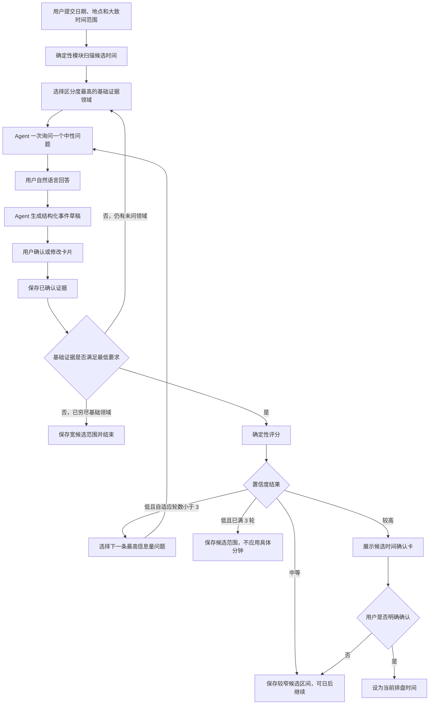
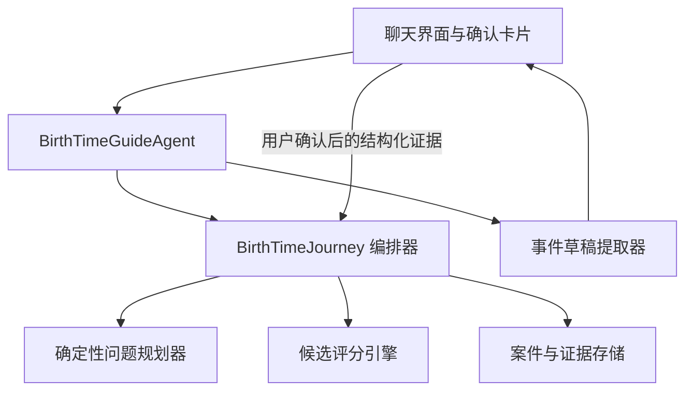

# Agent 引导式生时校正设计

日期：2026-07-18
状态：设计已确认，等待用户复核书面规格

## 1. 目标

将现有以固定问题和表单为主的生时校正，改为“Agent 对话引导 + 结构化确认卡片 + 确定性旅程编排”的混合流程。

核心原则：

> 确定性模块决定下一步做什么，Agent 决定怎样向用户表达。

Agent 可以解释、追问、理解自然语言并生成待确认草稿，但不得选择候选时间、计算置信度、决定路由、修改安全门或直接应用出生时间。

## 2. 已确认的产品决策

- 采用对话与操作卡片混合体验；
- 从第一题开始使用确定性自适应问题，不再固定展示首轮三题；
- 基础阶段以三条已确认经历、至少两个领域为评分门槛；如果用户只能提供一至两条，则保存宽候选范围并结束；
- 首次评分不足后，最多进行三轮自适应追问；
- 每轮只问一个当前信息价值最高的问题；
- 用户可以自然语言回答，Agent 只生成待确认的结构化草稿；
- 用户确认卡片后，证据才进入评分；
- 低置信度最多追问三轮后终止并保存候选范围；
- 中等置信度保存候选区间，不应用具体分钟；
- 较高置信度必须经过用户明确确认，才能更新当前排盘时间。

## 3. 非目标

- 不让大语言模型直接决定真实出生分钟；
- 不根据用户聊天语气、性格描述或未确认叙述评分；
- 不把内部一致性描述为已证明的历史真实分钟；
- 不在本次设计中降低现有置信度安全门；
- 不将生时校正接入按消息扣费的正式咨询入口；
- 不以外部 oracle 尚未闭环的结果宣称实证准确率。

## 4. 用户旅程



### 4.1 基础证据阶段

问题规划器从学业、搬迁、关系、事业、健康压力五个领域中按信息价值排序，一次选择一个尚未询问的领域。每个领域最多询问一次，避免基础阶段无限循环。

基础阶段满足以下条件后进入评分：

- 至少三条已确认事件；
- 至少覆盖两个领域。

如果五个领域已询问完仍不满足最低要求，流程终止为“基础证据不足”，保存用户资料和宽候选范围，不伪造低精度分钟。

### 4.2 自适应追问阶段

首次评分为低置信度时，确定性问题规划器最多再提出三条问题。每次展示一条问题即消耗一轮；用户选择“不记得”或“跳过”同样消耗该轮，以保证流程有确定上限。

用户确认新证据后，系统自动重新评分并返回下一动作。用户不再需要点击独立的“比较候选时间”按钮。

## 5. 模块边界



### 5.1 `BirthTimeJourney`

它是唯一的流程决策者，负责：

- 当前状态；
- 下一动作；
- 基础阶段进度和自适应轮数；
- 证据确认状态；
- 候选评分与置信度；
- 保存、确认和应用权限；
- 恢复时的状态规范化。

统一返回结构：

```ts
type JourneyTurn = {
  readonly caseId: string;
  readonly snapshot: JourneySnapshot;
  readonly nextAction: NextAction;
  readonly progress: {
    readonly phase: "baseline" | "adaptive" | "result";
    readonly baselineDomainCount: number;
    readonly confirmedEvidenceCount: number;
    readonly adaptiveRound: number;
    readonly maxAdaptiveRounds: 3;
  };
  readonly permissions: {
    readonly canScore: boolean;
    readonly canSaveCandidate: boolean;
    readonly canConfirmCandidate: boolean;
  };
  readonly turnVersion: number;
};
```

新协议用 `canConfirmCandidate` 表示候选已通过确定性安全门，并允许用户提交明确确认。确认接口在同一个服务端事务中更新 `active_birth_time` 和案件状态；不再向 Agent 或前端暴露一个容易被误解为“直接应用”的独立 `canApply` 动作。旧响应中的 `canApply` 仅在兼容层读取，不能作为新流程的权限来源。

### 5.2 确定性问题规划器

问题规划器读取候选分组、已确认的证据领域、已经问过的问题和剩余轮数，并返回一条 `QuestionSpec`：

```ts
type QuestionSpec = {
  readonly questionId: string;
  readonly phase: "baseline" | "adaptive";
  readonly domain: "education" | "relocation" | "relationship" | "career" | "health_pressure";
  readonly requestedPrecision: readonly ("day" | "month" | "year")[];
  readonly allowUnknown: true;
  readonly purposeCode: string;
  readonly plannerVersion: string;
};
```

问题价值由版本化规则确定：

```text
问题价值 =
候选组差异程度
+ 尚未覆盖领域奖励
+ 可获得日期精度奖励
- 已重复问题惩罚
- 回答负担
```

`purposeCode` 仅用于服务端审计，不向用户暴露哪个答案可能支持哪个候选，避免诱导和事后故事拟合。

### 5.3 `BirthTimeGuideAgent`

Agent 负责：

- 将 `QuestionSpec` 表达为自然、简短、中性的单个问题；
- 解释为什么需要日期和精度；
- 将自然语言整理为待确认草稿；
- 对低、中、高结果做不越权的解释；
- 根据 `nextAction` 引导用户继续、暂停或确认。

Agent 只允许调用：

- 获取当前 `JourneyTurn`；
- 提交事件草稿；
- 记录“不记得/跳过”；
- 暂停案件；
- 重新读取最新状态。

Agent 不允许：

- 提交已确认证据；
- 直接运行或覆盖评分；
- 设置置信度；
- 保存、确认或应用候选时间；
- 修改 `nextAction`、轮数或权限；
- 根据未确认聊天内容选择出生分钟。

证据确认和候选确认只能来自结构化 UI 动作，并在服务端再次校验 `turnVersion` 和权限。

### 5.4 事件草稿提取器

用户自然语言只用于生成草稿：

```json
{
  "domain": "career",
  "precision": "month",
  "date": "2023-04",
  "status": "draft"
}
```

提取器不得补猜缺失月份、日期或事件类型。字段不完整时，卡片显示缺失项，由用户补全。只有用户点击“确认并用于校正”后，状态才变为 `confirmed` 并进入评分输入。

## 6. `NextAction` 协议

`NextAction` 使用可穷尽判别的联合类型：

```ts
type NextAction =
  | { readonly kind: "ask_baseline_evidence"; readonly question: QuestionSpec }
  | { readonly kind: "ask_adaptive_evidence"; readonly question: QuestionSpec }
  | { readonly kind: "review_evidence_draft"; readonly draftId: string }
  | { readonly kind: "score_pending"; readonly jobId: string }
  | { readonly kind: "retry_scoring"; readonly jobId: string }
  | { readonly kind: "present_low_result"; readonly resultId: string }
  | { readonly kind: "present_medium_result"; readonly resultId: string }
  | { readonly kind: "request_candidate_confirmation"; readonly resultId: string }
  | { readonly kind: "ready"; readonly activeTime: string }
  | { readonly kind: "paused" };
```

系统保持以下不变量：

- 每个非终态快照必须有一个合法的可继续动作；
- 每个终态必须有结果说明和至少一个合法后续操作；
- `nextAction` 与快照在同一版本中写入；
- Agent 文案不是状态来源；
- 客户端不得从文案推断下一步。

## 7. 对话与界面

Agent 每次只问一个问题。回答后显示内联确认卡：

```text
工作或身份变化
时间：2023 年 4 月
精度：月份

[修改]  [确认并用于校正]
```

确认后卡片进入“正在比较候选时间”状态，系统自动显示下一题或最终结果。页面持续显示：

```text
生时校正 · 自适应第 2 / 3 轮
当前范围：04:00—07:59
已确认：4 条证据 / 3 个领域
```

用户始终可以：

- 回答“不记得”；
- 修改 Agent 提取的事件类型、日期或精度；
- 暂停并稍后继续；
- 主动结束并保存当前候选范围。

Agent 提问必须保持中性，不展示内部候选支持方向，也不要求用户为某个预测寻找对应经历。

## 8. 评分与安全门

现有确定性评分同时使用实际候选分钟、领域分盘、Vimshottari 与 Narayana Dasha。Agent 不参与计算。

低置信度条件包括：

- 最高候选并列；
- 少于三条有效事件；
- 少于两个事件领域；
- 必要计算层缺失；
- 领先区间超过 15 分钟；
- 第一名领先幅度低于 10%。

较高置信度必须同时满足：

- 至少四条有效事件；
- 至少覆盖三个领域；
- 只有一个领先区间；
- 领先区间不超过 5 分钟；
- 领先幅度至少 20%；
- 必要计算层完整。

满足基本安全门但未达到较高门槛的结果为中等置信度。

所有阈值必须记录算法版本。修改门槛需要独立校准和回归验证，不能通过 Agent 提示词、聊天内容或前端参数改变。

## 9. 自动推进与异步评分

用户确认证据后，系统将其视为一个完整逻辑动作：

1. 事务性保存证据、`actionId` 和预期 `turnVersion`；
2. 将快照切换为 `score_pending`；
3. 对宽范围案件创建幂等评分任务；
4. 后台评分完成后，原子写入候选结果、新快照和 `nextAction`；
5. 页面通过状态订阅或有上限的短轮询自动显示下一题或结果。

窄范围评分可以同步完成，但必须返回与异步路径相同的状态协议。用户不需要再点击“比较候选时间”，也不依赖 `resume` 触发状态迁移。

## 10. 恢复与兼容

`resume` 不偷偷执行新的评分，但必须：

- 恢复最新快照、草稿、已确认证据和候选结果；
- 返回已经持久化的 `nextAction`；
- 校验快照、结果和下一动作的一致性；
- 对缺少 `nextAction` 的旧案件使用确定性兼容规则重建；
- 对 `score_pending` 案件恢复任务状态或提供安全重试动作；
- 让客户端立即渲染恢复后的问题或结果卡。

旧版固定问卷答案继续保留用于审计，但新流程不再依赖其问题轮次推动状态。迁移不得覆盖原始填报时间或丢弃旧证据。

## 11. 幂等与并发

所有变更动作携带：

- `actionId`：同一用户动作的幂等键；
- `turnVersion`：乐观并发版本；
- `caseId`：所属案件；
- 经过认证的用户身份。

重复动作返回已完成结果。旧版本动作返回最新快照，不覆盖新数据。评分任务以案件、证据指纹和算法版本生成稳定幂等标识。

对外任务句柄必须是不可预测的随机标识，并同时校验登录用户、案件归属和有效期；稳定证据指纹只用于服务端内部去重，不能作为可枚举的查询凭据。

## 12. 异常处理

### Agent 不可用

使用由 `QuestionSpec` 映射的确定性备用文案和相同结构化卡片。Journey 可以继续，Agent 故障不改变状态或权限。

### 草稿提取不完整

不猜测缺失字段。展示待补全卡片，只有满足结构化校验后才允许确认。

### 评分失败

保留已确认证据，状态转为 `retry_scoring`。重试不重复保存证据，不消耗新的自适应轮数。

### 页面离开或网络中断

恢复最新 `turnVersion`。已确认动作依靠 `actionId` 防止重复提交，未确认草稿可以恢复或放弃。

### 非法或越权动作

服务端拒绝 Agent 直接确认、低/中置信度应用、过期结果确认以及不属于当前用户的案件访问。

## 13. 数据与隐私

- 评分引擎只接收事件类型、日期和日期精度；
- 用户自然语言不进入候选评分；
- 结构化证据与原始聊天消息分开保存；
- Agent 默认只读取当前案件所需上下文，不读取全部咨询历史；
- `reported_birth_time` 永久保留；
- 只有通过高置信度安全门并经用户明确确认，才可更新 `active_birth_time`；
- 结果文案使用“候选时间”和“当前排盘使用时间”，不得使用“已证明的真实出生分钟”。

## 14. 测试与验收

### 状态机和属性测试

- 所有非终态均有合法 `nextAction`；
- 所有终态均有结果和合法操作；
- 相同输入与算法版本产生相同问题和评分；
- 三轮自适应追问必定终止；
- 跳过、暂停、恢复和重试不破坏轮数；
- Agent 输出无法改变状态和权限。

### 服务与契约测试

- 草稿不能直接成为评分证据；
- 用户确认后自动进入评分；
- 评分完成后原子保存结果与下一动作；
- `resume` 重建缺失的旧版 `nextAction`；
- `actionId` 防止重复提交；
- `turnVersion` 防止旧页面覆盖新状态；
- 低、中置信度确认应用必须被服务端拒绝；
- Agent 直接提交确认或应用动作必须被拒绝。

### 端到端场景

1. 基础证据充足并达到较高置信度：自动进入候选确认，用户确认后才更新排盘时间；
2. 三轮后仍为低置信度：保存候选范围并终止，不出现循环或空白页；
3. 模糊自然语言：生成待补全草稿，不补猜日期；
4. 刷新和换设备：恢复当前问题、轮数、草稿和结果；
5. Agent 不可用：备用文案和卡片仍可完成流程；
6. 评分失败：证据不丢失，重试不重复计数；
7. 重复点击确认：相同动作仅执行一次；
8. 越权请求：无法绕过高置信度与用户确认安全门。

### 手工体验验收

- 桌面与手机宽度均能完成全流程；
- 每轮只出现一个主要问题；
- 确认事件后无需额外“比较”按钮；
- 计算期间有明确状态；
- 低、中、高结果都有清晰下一步；
- 不存在“没有问题、没有结果、没有按钮”的状态。

## 15. 观测指标

只记录流程和结构化质量指标：

- 校正完成率；
- 基础问题数量和自适应轮数；
- Agent 草稿被修改的比例；
- 低、中、高置信度分布；
- 各状态退出率；
- 评分失败与恢复成功率；
- 非法快照或缺失 `nextAction` 的数量。

不得将用户事件自然语言内容写入产品分析指标。

## 16. 分阶段上线

1. 影子模式：新问题规划器只计算、不展示，与当前流程结果比较；
2. 内部测试：限定测试账号使用 Agent 引导流程；
3. 小流量开放：监控草稿修正率、退出率、评分耗时和非法状态；
4. 默认启用：旧案件通过确定性兼容层恢复；
5. 稳定后移除固定三题和手动“比较候选时间”入口。

## 17. 成功标准

- 用户可以用自然语言完成证据提交，同时每条评分证据都经过结构化确认；
- 系统自动推进到下一题或结果，不再依赖用户理解 `resume` 或额外比较动作；
- 任意恢复点都有明确问题、计算状态、结果或操作；
- Agent 故障不会阻断确定性校正流程；
- Agent 无法改变候选、置信度、轮数、路由和应用权限；
- 三轮自适应追问后必定安全终止；
- 原始填报时间始终保留，具体分钟只能在较高置信度且用户确认后成为当前排盘时间。

## 18. 已知准确性边界

当前事件评分已经具备可复现的本地工程链路，但外部 oracle 与真实案例校准仍未闭环。设计中的置信度是版本化内部安全门，不等于已经证明历史真实分钟。正式上线文案和分析指标必须保留这一边界；后续阈值调整需要独立的真实案例和外部参照验证任务。
