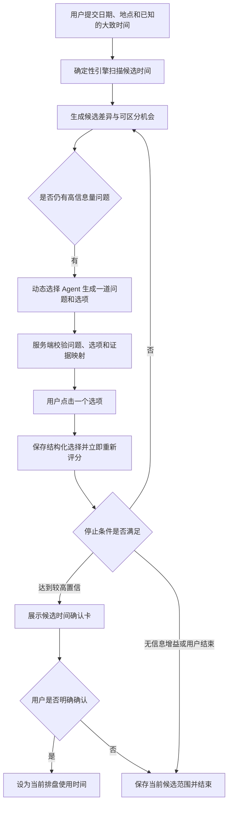
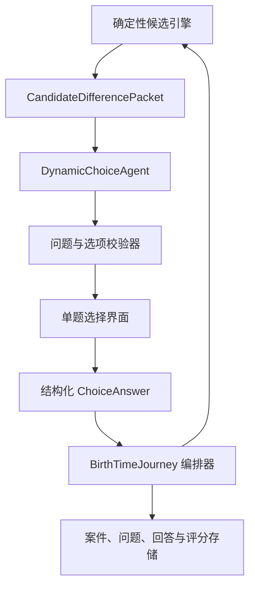

# 动态选择 Agent 生时校正设计

日期：2026-07-18
状态：设计已确认，可以实施

## 1. 目标

将现有“固定领域、固定轮数、自然语言输入后再次确认日期”的生时校正，替换为“动态选择 Agent + 确定性候选评分”的混合流程。

核心原则：

> 大模型根据当前候选差异和既往回答动态生成下一道问题与可点击选项；确定性占星计算负责重新评分、缩小候选范围和执行应用安全门。

用户默认只需点击选项。系统不预先承诺固定题数，不因一次低置信结果从头重问，也不让大模型凭叙述直接猜出生分钟。

## 2. 已确认的产品决策

- 不再使用固定五个经历领域或固定三轮追问作为正常业务流程；
- 每轮只展示一道由大模型动态生成的问题和 2–4 个主要选项；
- 每题固定提供“不确定 / 不记得”和“都不符合”；
- 点击主要选项后立即保存并重新评分，不出现草稿页或二次确认；
- 点击“都不符合”时才展开可选的简短补充输入；
- 补充文字只帮助 Agent 生成新的可点击选项，不直接进入候选评分；
- 是否继续由当前候选差异、信息增益和评分变化决定，不由公开轮数决定；
- 用户可以随时暂停或主动结束并保存当前候选范围；
- 终态不能自动回到提问状态；开始新评估必须是用户明确选择的新动作；
- 服务端保留 10 个有效问题的隐藏异常安全上限，但不向用户显示，也不作为正常结束标准；
- 低、中置信结果只能保存范围；较高置信结果仍需用户明确确认后才能更新当前排盘时间。

## 3. 非目标与安全边界

- 不让大模型直接输出、选择或应用出生分钟；
- 不让大模型设置置信度、评分权重或候选排序；
- 不根据聊天语气、性格标签或未经结构化选择的文字评分；
- 不把内部一致性描述为已证明的历史真实分钟；
- 不通过提示词、前端参数或模型建议降低现有应用安全门；
- 不把隐藏安全上限展示成“必须回答十题”；
- 不将生时校正接入按消息扣费的正式咨询入口；
- 不以尚未闭环的外部 oracle 或真实案例校准宣称实证准确率。

## 4. 用户旅程



### 4.1 默认点击路径

每轮只出现一个主任务。用户点击选项后，客户端立即进入“正在缩小候选范围”，完成后显示下一题或结果。

默认路径没有：

- 自由文本必填框；
- 日期精度下拉框；
- 经历草稿页；
- “整理为草稿”按钮；
- 对同一答案的再次确认；
- 独立的“比较候选时间”按钮。

### 4.2 不匹配路径

用户点击“都不符合”后，可以填写一句简短补充。补充内容只进入当前案件的 Agent 上下文。Agent 必须把它转换成新的结构化选择题；只有用户随后点击了服务端校验通过的选项，才形成评分证据。

### 4.3 结束路径

正常结束依据评分和信息增益，不依据固定题数。结束后案件持久化为终态。刷新、重新登录或换设备都恢复结果页，不得自动创建新案件或重新显示第一题。

## 5. 混合架构



### 5.1 确定性候选引擎

候选引擎负责：

- 扫描当前候选时间；
- 计算候选分组、领先幅度、区间宽度和必要计算层；
- 生成仍可区分候选的机会集合；
- 为每个机会提供服务端证据分区和预估信息增益；
- 接收结构化选择并重新评分；
- 决定低、中、高置信度和候选应用权限。

候选引擎不负责面向用户的表达。

### 5.2 `CandidateDifferencePacket`

候选引擎向 Agent 提供最小必要差异包：

```ts
type CandidateDifferencePacket = {
  readonly caseId: string;
  readonly scoringVersion: string;
  readonly currentRange: TimeRange;
  readonly opportunities: readonly QuestionOpportunity[];
  readonly askedQuestionFingerprints: readonly string[];
  readonly candidatePartitionFingerprints: readonly string[];
  readonly recentRangeHistory: readonly TimeRange[];
};

type QuestionOpportunity = {
  readonly opportunityId: string;
  readonly dimensionCode: string;
  readonly neutralContext: string;
  readonly estimatedInformationGain: number;
  readonly partitions: readonly EvidencePartition[];
};
```

`EvidencePartition` 和内部候选支持方向不向客户端暴露。Agent 只能引用服务端提供的分区标识，不能发明评分权重或候选时间。

### 5.3 `DynamicChoiceAgent`

Agent 负责：

- 从当前机会集合中选择最适合用户回答的一项；
- 结合既往选择生成简短、中性、不诱导的问题；
- 为服务端分区生成 2–4 个容易点击的用户文案；
- 在“都不符合”后根据补充信息重新组织问题；
- 当所有剩余机会都低价值时返回 `no_useful_question` 建议。

Agent 不负责：

- 生成候选时间；
- 修改证据分区；
- 决定评分、置信度或应用权限；
- 根据选项文案暗示哪个答案支持哪个候选；
- 把补充文字直接转换成已评分证据。

### 5.4 问题与选项校验器

模型输出必须经过严格结构解析：

```ts
type DynamicChoiceQuestion = {
  readonly questionId: string;
  readonly opportunityId: string;
  readonly prompt: string;
  readonly options: readonly ChoiceOption[];
  readonly questionFingerprint: string;
  readonly candidatePartitionFingerprint: string;
};

type ChoiceOption = {
  readonly optionId: string;
  readonly label: string;
  readonly partitionId: string;
};
```

服务端必须验证：

- `opportunityId` 属于当前差异包；
- 每个 `partitionId` 属于该机会；
- 主要选项数量为 2–4；
- 文案长度、内容和中性约束合法；
- 问题指纹和候选分组指纹没有重复；
- 问题仍对应当前 `turnVersion` 和评分版本。

### 5.5 `BirthTimeJourney`

Journey 是唯一的状态决策者，负责：

- 持久化当前问题及完整选项，确保刷新后不重新生成；
- 接收用户点击并从服务端读取对应证据分区；
- 创建幂等评分任务；
- 应用停止规则；
- 持久化问题、回答、候选变化和终态；
- 拒绝终态自动转回提问；
- 管理候选保存、候选确认和当前排盘时间更新权限。

## 6. 状态与协议

### 6.1 `NextAction`

```ts
type NextAction =
  | { readonly kind: "generate_dynamic_question" }
  | { readonly kind: "ask_dynamic_choice"; readonly question: DynamicChoiceQuestion }
  | { readonly kind: "clarify_unmatched_answer"; readonly questionId: string }
  | { readonly kind: "score_pending"; readonly jobId: string }
  | { readonly kind: "retry_question_generation" }
  | { readonly kind: "retry_scoring"; readonly jobId: string }
  | { readonly kind: "present_low_result"; readonly resultId: string | null }
  | { readonly kind: "present_medium_result"; readonly resultId: string }
  | { readonly kind: "request_candidate_confirmation"; readonly resultId: string }
  | { readonly kind: "ready"; readonly activeTime: string }
  | { readonly kind: "paused" };
```

### 6.2 进度

界面不再显示固定轮数。新的进度只描述已发生的事实：

```ts
type JourneyProgress = {
  readonly phase: "question" | "clarification" | "scoring" | "result" | "ready" | "paused";
  readonly answeredCount: number;
  readonly effectiveAnswerCount: number;
  readonly currentRange: TimeRange;
  readonly previousRange: TimeRange | null;
  readonly plateauCount: number;
};
```

隐藏异常安全计数仅保存在服务端控制状态中，不作为 UI 进度或用户承诺。

### 6.3 回答

客户端只提交题目和选项标识：

```ts
type ChoiceAnswerCommand = {
  readonly caseId: string;
  readonly actionId: string;
  readonly turnVersion: number;
  readonly questionId: string;
  readonly optionId: string;
};
```

客户端不得提交 `partitionId`、候选支持方向、评分或时间范围。服务端从已持久化问题中解析真实证据映射。

## 7. 界面设计

### 7.1 问题卡

```text
哪一种情况更接近你的实际经历？

[ 2018—2020 年有过明显搬迁或长期异地 ]
[ 这几年居住地点基本稳定 ]
[ 有变化，但时间不确定 ]

[ 不确定 / 不记得 ]   [ 都不符合 ]
```

- 主要选项使用整行按钮，触控目标至少 44px；
- 单击后立即提交，无二次确认；
- 提交期间锁定所有选项并显示“正在缩小候选范围”；
- 失败时恢复原选择题，不生成另一题；
- 键盘、触屏和屏幕阅读器均可完成；
- 不显示哪个选项支持哪个候选。

### 7.2 进度摘要

页面显示：

```text
已完成 4 个有效判断
当前候选范围：05:38—05:49
```

不显示“第 2 / 3 轮”或一个并不存在的固定总题数。

### 7.3 “都不符合”

点击后展开一个简短、可选、最多 240 字的补充框。提交补充后显示“正在重新组织问题”，成功后仍回到可点击选项。补充内容本身没有评分权重。

### 7.4 结果

- 低置信：说明当前证据无法继续稳定区分，保存现有范围并结束；
- 中等置信：保存较窄候选区间，可日后以新证据开启新的评估；
- 较高置信：展示候选时间与当前排盘使用时间的区别，并请求明确确认；
- 终态不显示会偷偷重启同一流程的“重新评估”按钮；
- 新评估入口必须明确写成“开始新的评估”，并说明旧结果会保留。

## 8. 停止规则与防循环

正常停止满足以下任一条件：

1. 确定性评分达到较高置信门槛；
2. 候选引擎没有返回达到最低信息增益的机会；
3. 连续两次有效回答后，候选区间、候选排序和领先幅度均未发生实质变化；
4. Agent 只能生成已出现过的问题指纹或候选分组指纹；
5. 用户主动结束并保存当前范围；
6. 模型持续不可用且确定性备用问题也无法生成；
7. 隐藏异常安全计数达到 10 个有效问题。

防循环不变量：

- 同一 `questionFingerprint` 在一个案件中最多展示一次；
- 同一 `candidatePartitionFingerprint` 不得换文案重复询问；
- `present_low_result`、`present_medium_result` 和 `ready` 恢复后仍是终态；
- 终态转入问题态必须携带用户明确创建的新 `caseId`；
- 重试生成、重试评分、暂停和恢复均不增加有效问题计数；
- “不记得”不会反复询问同一维度，而是降低该机会价值并尝试其他维度。

## 9. 评分与应用安全门

确定性评分继续使用实际候选分钟、相关分盘、Vimshottari 与 Narayana Dasha。Agent 不参与计算。

低置信度包括候选并列、必要计算层缺失、范围仍过宽或领先幅度不足。满足基本安全门但未达到应用门槛的结果为中等置信度。

较高置信度必须同时满足版本化的候选唯一性、区间宽度、领先幅度、证据充分性和计算层完整性门槛。所有阈值由评分算法版本管理，不能由 Agent 输出或前端参数改变。

只有较高置信结果并经用户明确确认，才能在同一服务端事务中更新 `active_birth_time`。`reported_birth_time` 永久保留。

## 10. 自动推进与异步处理

用户点击选项后，系统执行一个完整逻辑动作：

1. 校验 `caseId`、`turnVersion`、`questionId` 和 `optionId`；
2. 事务性保存选择、`actionId` 和服务端证据映射；
3. 将状态切换为 `score_pending`；
4. 创建以案件、证据指纹和评分版本去重的幂等任务；
5. 评分完成后原子写入候选结果和停止判断；
6. 需要继续时创建 `generate_dynamic_question`；
7. 模型输出校验通过后，持久化完整问题与选项，再返回 `ask_dynamic_choice`；
8. 页面自动显示下一题或结果。

模型生成和评分都可以异步，但必须使用同一持久化状态协议。`resume` 只恢复状态，不偷偷推进或创建新案件。

## 11. 异常处理

### 11.1 Agent 输出非法

结构解析或映射校验失败时自动重试一次。仍失败则使用候选引擎提供的最高信息增益机会生成确定性备用选择题。失败不会改变评分、计数或当前候选。

### 11.2 Agent 暂时不可用

如果已有持久化问题，继续展示同一道题；如果尚未生成问题，允许重试、暂停或使用确定性备用题。不得清空回答或从头评估。

### 11.3 评分失败

保留已点击答案，状态进入 `retry_scoring`。重试同一任务，不重复保存证据、不增加有效问题计数、不生成新题。

### 11.4 “都不符合”补充失败

保留补充内容和原题，允许重试或选择“不确定 / 不记得”。补充文字不直接改变候选结果。

### 11.5 页面离开或网络中断

恢复最新 `turnVersion`、持久化问题、选项、已选答案、候选范围和终态。重复点击依靠 `actionId` 返回已完成结果。

### 11.6 非法或越权动作

服务端拒绝模型直接提交答案、客户端提交证据分区、过期题目回答、低中置信结果应用、不属于当前用户的案件访问，以及终态上的普通回答动作。

## 12. 数据与隐私

- Agent 默认只读取当前案件所需的候选差异摘要、问题历史和回答摘要；
- 内部候选支持方向和证据分区不发送到客户端；
- 用户补充文字与结构化选择分开存储；
- 补充文字不写入产品分析指标，也不直接进入评分；
- 模型日志不得包含用户身份、完整出生资料或服务端候选权重；
- `reported_birth_time` 永久保留；
- 结果文案使用“候选时间”和“当前排盘使用时间”，不得使用“已证明的真实出生分钟”。

## 13. 恢复与旧案件迁移

- 已确认的旧经历、选择题答案和候选结果继续保留；
- 未确认的自然语言草稿仅作为当前案件的 Agent 上下文，不直接计分；
- 旧案件恢复时先基于现有候选状态生成新的差异包，不重新询问已确认的信息；
- 迁移后的第一道动态题必须排除旧问题及候选分组指纹；
- 已处于低、中、高结果或 ready 状态的旧案件保持终态；
- 旧版固定问卷和日期证据继续保留用于审计，但不再决定正常流程轮次；
- 迁移不得覆盖原始填报时间、丢弃已确认证据或创建重复案件。

## 14. 幂等与并发

所有变更动作携带：

- `actionId`：同一用户动作的幂等键；
- `turnVersion`：乐观并发版本；
- `caseId`：所属案件；
- 经过认证的用户身份。

重复动作返回已完成结果。旧版本动作返回最新状态，不覆盖新数据。模型生成任务以案件、候选差异指纹和提示版本去重；评分任务以案件、证据指纹和算法版本去重。

对外任务句柄必须是不可预测的随机标识，并校验登录用户、案件归属和有效期。稳定指纹只用于服务端内部去重，不能作为可枚举的查询凭据。

## 15. 测试与验收

### 15.1 单元与属性测试

- 动态问题、选项和映射必须通过严格结构解析；
- Agent 不能引用当前差异包之外的机会或证据分区；
- 相同问题指纹或候选分组指纹不能再次展示；
- 连续无信息增益、无可用机会、用户结束和隐藏安全上限都会进入终态；
- 终态无法通过普通恢复、重试或回答动作返回问题态；
- Agent 输出无法改变评分、置信度和应用权限。

### 15.2 服务与契约测试

- 用户点击后直接保存选择并进入评分，不产生草稿确认状态；
- 客户端不能提交 `partitionId`、评分或候选时间；
- 评分完成后原子保存候选变化、停止判断和下一动作；
- 持久化问题在刷新后保持相同文案、选项和标识；
- `actionId` 防止重复提交，`turnVersion` 防止旧页面覆盖新状态；
- 模型失败回退不改变证据或有效问题计数；
- 低、中置信结果应用必须被服务端拒绝。

### 15.3 端到端场景

1. 多轮动态选择后达到较高置信，用户确认后更新当前排盘时间；
2. 候选连续不再变化，保存范围并结束，不出现循环；
3. Agent 动态生成的问题和选项随候选差异变化，而非固定题库顺序；
4. 用户全程只点击选项即可完成；
5. “不记得”切换到其他区分维度，不重复原题；
6. “都不符合”补充内容生成新的可点击选项，文字本身不计分；
7. 模型输出非法或不可用时回退到确定性选择题；
8. 评分失败后重试同一任务，不重复计数或换题；
9. 刷新、暂停、换设备恢复同一道题或同一结果；
10. 旧终态案件恢复后仍停留在结果，不重新开始；
11. 重复点击同一选项只执行一次；
12. 越权请求无法绕过候选确认安全门。

### 15.4 手工体验验收

- 桌面与手机均保持一题一屏；
- 所有主要选项和辅助动作至少 44px；
- 用户不输入文字也能完成正常流程；
- 点击后有明确的评分状态，不需要理解内部阶段；
- 页面不显示固定总轮数；
- 低、中、高结果都有清晰且不循环的下一步；
- 不存在“没有问题、没有结果、没有按钮”的非终态。

## 16. 观测指标

只记录流程和结构化质量指标：

- 校正完成率和主动结束率；
- 每个案件的有效问题数分布；
- 每题选择率、“不记得”率和“都不符合”率；
- 候选范围每次回答后的缩小幅度；
- 连续无信息增益终止率；
- 重复问题或重复候选分组被拒绝的次数；
- 模型生成失败、结构校验失败和确定性回退率；
- 低、中、高置信度分布；
- 终态恢复后错误进入问题态的数量；
- 评分失败与恢复成功率。

不得记录用户补充文字、出生资料、选项对应的内部候选支持方向或可反推出个人信息的组合。

## 17. 分阶段上线

1. 影子模式：动态 Agent 生成问题但不展示，与现有流程的信息增益比较；
2. 内部测试：限定测试账号使用动态选择流程；
3. 小流量开放：监控选项点击率、问题重复率、回退率、候选缩小幅度和退出率；
4. 默认启用：旧案件通过兼容层恢复到当前候选状态；
5. 稳定后移除固定领域轮次、日期必填、自然语言草稿确认和意外重新评估入口。

## 18. 成功标准

- 大模型根据每次候选变化动态生成问题和答案选项；
- 用户可以只通过点击完成正常校正流程；
- 每次点击后自动评分并显示下一题或结果，没有重复确认；
- 正常结束由置信度和信息增益决定，而不是固定五领域或固定三轮；
- 同一问题、同一候选分组和同一终态都不会循环；
- Agent 故障不会丢失状态，并可回退到确定性选择题；
- Agent 无法改变候选排序、置信度、时间范围和应用权限；
- 原始填报时间始终保留，具体分钟只能在较高置信度且用户确认后成为当前排盘时间。

## 19. 已知准确性边界

当前候选评分具备可复现的本地工程链路，但外部 oracle 与真实案例校准仍未闭环。设计中的置信度是版本化内部安全门，不等于已经证明历史真实分钟。正式上线文案和分析指标必须保留这一边界；后续阈值调整需要独立的真实案例和外部参照验证任务。
