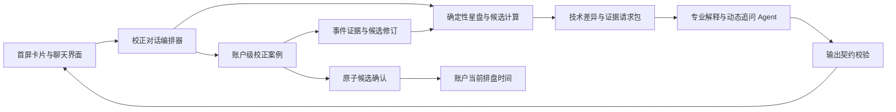
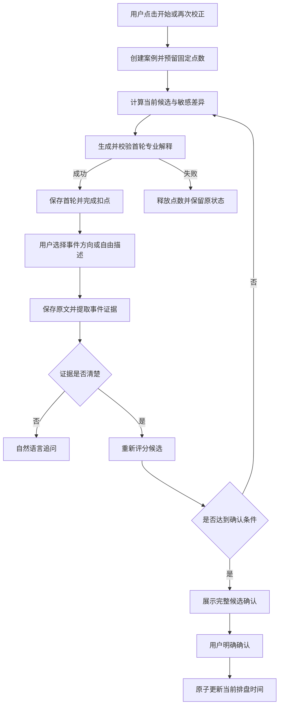

# 首屏卡片聊天式生时校正设计

日期：2026-07-20

状态：设计已确认，等待书面审核

## 1. 背景

产品当前存在两条名称相同、业务职责却不同的“生时校正”路径：

1. 初始化流程调用 `/api/birth-time-journey`，以动态选择题推进持久化案例；
2. 首页卡片把“生时校正”或“再次校正”放入输入框，发送后调用普通 `/api/consult`，由咨询工作流和 Agent 生成有星盘依据的自然语言分析。

初始化路径具备案例、轮次、候选、恢复和确认记录，但其宽泛年份区间选择题无法承载真实人生证据，也把高认知成本的专业服务变成了首次使用门槛。首页卡片路径能够生成专业的候选解释、技术边界和高区分度事件追问，却只形成普通聊天消息，不能持久化正式校正进度或安全更新当前排盘时间。

本设计将两条路径合并为一条：

> 首屏卡片和自然聊天是唯一用户校正流程；真实星盘推算负责判断；账户级校正案例负责保存证据、候选、费用、版本和最终确认。

## 2. 与既有设计的关系

本设计对现有文档作如下收敛：

- 取代 `2026-07-18-agent-guided-birth-time-rectification-design.md` 中“动态选择题是默认用户主流程”的决策；
- 保留该设计中的确定性候选计算、服务端证据边界、幂等动作、轮次版本、评分任务和终态安全门；
- 扩展 `2026-07-19-private-consultation-entrypoints-design.md`：`birth_time_rectification` 不再只是普通咨询提示词入口，而是正式校正案例入口；
- 取代 `2026-07-19-birth-time-terminal-completion-design.md` 中“低置信代表时间可直接采用”的新流程规则；新流程只能在明确候选确认协议成功后替换当前排盘时间；
- 历史案例和审计记录不删除。尚未完成的旧协议案例通过新修订案例承接，不原地改写历史协议和原始证据。

## 3. 目标

- 初始化只采集用户实际知道的出生事实，不强制完成生时校正；
- 未校正用户可以进入首页并自由选择使用未校正时间咨询，或先校正再咨询；
- 首屏卡片成为开始、继续和再次校正的唯一产品入口；
- 保留现有卡片咨询能够生成的专业候选解释、技术依据和动态事件追问；
- 将每轮自然语言对话归一化为正式事件证据，并持久化候选变化和推算依据；
- 支持刷新、换设备、新对话、暂停和网络重试后的安全恢复；
- 再次校正期间继续使用原确认时间，只有用户明确确认新候选后才替换；
- 一次校正案例固定收费，同一案例内的所有追问和恢复不重复收费；
- 校正完成后恢复用户之前保存的普通咨询问题。

## 4. 非目标与硬边界

- 不让大模型直接决定、写入或确认出生分钟；
- 不把普通聊天消息当作唯一校正记录；
- 不用尚未发生的未来窗口作为校正评分证据；
- 不以性格描述、情绪标签或宽泛年份区间作为默认高质量证据；
- 不要求每轮只能点击固定选项；
- 不因用户选择“都不符合”而产生异常或强迫其补充；
- 不在新校正完成前覆盖当前已确认时间；
- 不删除历史案例、旧候选、原始填报和用户确认记录；
- 不在本设计中改变普通咨询的模型选择和常规扣点价格。

## 5. 已确认的业务规则

### 5.1 初始化与软引导

初始化只采集：

- 出生日期；
- 出生地点；
- 用户知道的具体时间或大致时段；
- 时间来源；
- 用户声明的不确定范围或文字线索。

用户无需完成校正即可进入首页。未校正用户发起依赖本命盘的普通咨询时，界面提供两种选择：

1. `先用未校正时间询问`：在当前对话内继续，所有相关回答标明时间未经校正并降低分钟敏感结论的置信度；
2. `先校正再询问`：保存原始问题，启动或恢复校正案例，校正完成后再接续原问题。

“先用未校正时间询问”的选择只在当前聊天会话有效。新建聊天时重新温和提示一次，不逐条消息重复打断。用户只有时段或完全不知道具体分钟时，不得虚构工作时间；可以进入校正，或进行不依赖精确出生时间的一般咨询。

### 5.2 卡片状态

- 没有历史案例：显示 `开始生时校正`；
- 存在未完成案例：显示 `继续上次校正`，并提供次级操作 `重新开始`；
- 已有确认时间且没有未完成修订：显示 `再次校正`；
- 新修订进行中：继续使用旧确认时间，并标记 `新校正进行中`；
- 暂停、失败或放弃新修订不影响旧确认时间；
- 删除或新建聊天不删除、不重置校正案例。

### 5.3 计费

- 固定点数由服务端产品配置提供，并在卡片启动操作旁明确显示；客户端不得硬编码或自行提交价格；
- 启动全新校正案例时预留一次固定点数；
- 正式案例创建成功并展示第一轮有效专业分析后完成扣点；
- 案例创建失败、服务不可用或第一轮有效分析未生成时释放预留点数；
- 暂停、刷新、换设备和继续同一案例不重复收费；
- 同一案例中的追问、事件提取、候选重算和最终确认均包含在本次固定费用内；
- 已完成或用户明确放弃后发起全新案例，重新收取一次固定费用；
- 校正前保存的普通咨询问题不提前扣咨询点数。校正完成后，用户确认继续回答时才按普通咨询规则扣点。
- 上线前已经存在的未完成旧协议案例免费承接一次新对话式修订，避免用户为历史缺陷和协议迁移再次付费；承接后的新案例仍使用标准费用回执标记为迁移豁免。

## 6. 目标架构



### 6.1 首屏卡片与聊天界面

该层只负责呈现和用户输入：

- 展示完整专业解释；
- 展示事件方向按钮，例如事业、学业、搬迁；
- 始终保留自由输入；
- 展示结构化事件摘要并允许纠正；
- 展示暂停、继续、放弃和最终确认；
- 不在客户端计算候选、设置置信度或决定状态转换。

聊天会话是呈现载体，不是校正事实来源。聊天删除后，案例仍可从任意新聊天继续。

### 6.2 校正对话编排器

编排器是每轮业务动作的统一入口，负责：

- 创建、恢复或修订账户级案例；
- 读取当前声明时间、旧确认时间、候选范围和既往证据；
- 调用确定性计算生成候选差异；
- 调用 Agent 生成面向用户的专业解释和下一步事件请求；
- 校验 Agent 输出与计算包一致；
- 保存用户原文、事件提取、技术回执、可见解释和候选修订；
- 用 `actionId` 与 `turnVersion` 保证幂等和并发安全；
- 管理固定费用、暂停、恢复、放弃和原始咨询问题接续。

### 6.3 确定性计算与 Agent 的边界

确定性计算负责：

- 建立和扫描候选时间范围；
- 计算 D1 稳定性、上升边界距离和分钟敏感结构；
- 比较 D9、D10 等分盘及当前支持的技术层；
- 生成不同候选之间可验证的差异；
- 根据已经发生的事件证据重新评分；
- 产生候选范围、代表时间、可信边界和停止条件。

Agent 负责：

- 把技术包解释成自然、可理解的中文；
- 说明当前时间为何只能作为填报时间或待验证候选；
- 选择当前最有区分度且用户容易回答的事件领域；
- 询问具体、已发生、可给出日期精度的人生事件；
- 根据用户回答调整下一轮问题方向；
- 在信息不足时诚实说明，而不是生成虚假精确分钟。

Agent 不得发明技术包中不存在的盘面事实、候选时间、置信度、评分权重或确认状态。

## 7. 领域模型与持久化

### 7.1 `RectificationCase`

账户级校正案例至少包含：

```ts
type RectificationCase = {
  id: string;
  userId: string;
  protocol: "conversational-evidence-v3";
  status: "starting" | "active" | "paused" | "confirming" | "completed" | "abandoned";
  turnVersion: number;
  revisionOfCaseId: string | null;
  importedFromCaseId: string | null;
  baselineActiveTime: string | null;
  declaredBirthInput: DeclaredBirthInput;
  currentCandidate: CandidateRevision | null;
  pendingConsultationQuestion: string | null;
  billingState: "reserved" | "charged" | "released" | "migration_waived";
  billingReservationId: string | null;
  billingReceiptId: string | null;
};
```

`baselineActiveTime` 在再次校正期间保持为账户当前时间。候选结果保存在案例内部，不得在确认前写入账户当前排盘时间。

### 7.2 `RectificationTurn`

每轮保存：

- 当前案例版本；
- 用户可见专业解释；
- 结构化技术依据和计算版本；
- 推荐事件方向；
- 请求的日期精度；
- 用户原始回答；
- 事件提取结果；
- 本轮前后候选范围；
- Agent、模型和输出校验回执；
- 幂等动作标识与时间戳。

用户可见解释需要保留，以便恢复后理解为何进入当前问题；技术包使用结构化字段存储，不能依赖重新调用模型复原历史理由。

### 7.3 `LifeEventEvidence`

事件证据包含：

```ts
type LifeEventEvidence = {
  id: string;
  caseId: string;
  rawText: string;
  domain: "career" | "education" | "relocation" | "relationship" | "family" | "other";
  eventSummary: string;
  dateValue: string | null;
  datePrecision: "day" | "month" | "year" | "range" | "unknown";
  extractionStatus: "clear" | "needs_clarification" | "corrected";
  sourceTurnId: string;
};
```

系统先保存用户原文，再保存提取结果。信息清楚时无需增加强制二次确认，但必须在下一轮以可见摘要回显并允许用户纠正；信息模糊时先追问，不进入评分。

## 8. 每轮响应契约

新校正响应必须同时包含用户可见解释与机器控制数据：

```ts
type ConversationalRectificationTurn = {
  caseId: string;
  turnVersion: number;
  narrative: string;
  candidate: {
    status: "declared" | "pending_validation" | "ready_for_confirmation" | "confirmed";
    representativeTime: string | null;
    rangeStart: string | null;
    rangeEnd: string | null;
  };
  technicalReceipt: {
    calculationVersion: string;
    stableLayers: string[];
    sensitiveLayers: string[];
    candidateDifferenceRefs: string[];
  };
  evidenceRequest: {
    domains: EvidenceDomain[];
    datePrecision: "month_preferred" | "year_accepted";
    freeTextAllowed: true;
  } | null;
  actions: RectificationAction[];
};
```

界面先展示 `narrative`，再展示事件方向按钮和自由输入框。按钮只表示用户希望从哪个领域开始，不直接代表支持某个候选的评分证据。

### 8.1 回答节奏

- 首轮：完整解释当前候选、可用边界、稳定层、敏感层和最有区分度的事件方向；
- 中间轮：聚焦新证据导致的候选变化、已记录事件摘要和下一步；
- 最终轮：完整总结候选时间、支持证据、残余不确定性、确认影响和旧时间替换规则。

未来窗口可以作为背景解释，但必须标记为技术候选窗口，且不能计入校正评分。

## 9. 业务流程

### 9.1 从卡片主动开始



### 9.2 从普通问题分流

用户选择“先校正再询问”后：

1. 原始问题保存到案例；
2. 普通咨询不扣点、不生成回答；
3. 启动或恢复校正并按固定校正费用处理；
4. 校正完成后提示 `使用新确认时间继续回答原问题`；
5. 用户确认继续时，创建普通咨询扣点并使用新确认时间回答；
6. 校正暂停时，原始问题继续保留。

### 9.3 旧案例承接

旧 `dynamic-choice-v2` 和 legacy 案例不原地改写。用户继续旧未完成案例时：

1. 读取旧案例最新候选范围、原始资料和已经形成的有效证据；
2. 创建 `conversational-evidence-v3` 修订案例，设置 `importedFromCaseId`；
3. 保留旧案例为只读历史；
4. 新案例首轮解释当前继承的候选范围，并从真实技术差异生成新的事件追问；
5. 不再向用户恢复宽泛年份区间选择题。

该承接属于同一未完成任务，使用一次 `migration_waived` 费用回执，不收取固定费用；只有明确放弃或完成后开启全新案例才按当前价格收费。

## 10. 异常恢复与一致性

### 10.1 启动与计费失败

- 案例创建、第一轮计算或第一轮有效解释失败时释放预留点数；
- 不显示成功状态，不创建无法继续的收费案例；
- 同一启动 `actionId` 重试时返回同一案例和费用结果。

### 10.2 网络错误

- 502、连接中断和非 JSON 响应使用同一幂等动作进行有限重试；
- 重试失败显示稳定中文错误和可追踪诊断分类；
- 保留用户刚输入的事件，不泄漏 WebKit 原始英文 `DOMException` 文案；
- 部署切换期间未到达业务服务的请求不得产生扣费或轮次推进。

### 10.3 并发与恢复

- 所有推进动作校验案例所有权、`turnVersion` 和 `actionId`；
- 两台设备同时操作时，旧版本返回“进度已更新”，客户端加载最新一轮；
- 刷新、换设备和新聊天根据账户未完成案例恢复；
- “都不符合”是正常答案：可以直接换事件方向，也可选填说明，不作为错误；
- 删除聊天不级联删除校正案例。

### 10.4 Agent 输出不一致

- `narrative` 中的候选时间、盘面事实和敏感层必须能映射到 `technicalReceipt`；
- 输出契约解析失败或事实不一致时，本轮不持久化为已推进状态；
- 可以重试表达生成，但不能重新计算或重复扣费；
- 多次表达失败时展示结构化安全回退，允许稍后继续。

### 10.5 原子候选确认

最终确认在单个数据库事务或等价原子 RPC 中完成：

1. 校验用户所有权；
2. 校验案例仍处于最新 `confirming` 轮次；
3. 校验候选结果、代表时间和技术版本未变化；
4. 写入用户确认和动作回执；
5. 更新账户当前排盘时间及状态；
6. 关闭本次案例；
7. 保留旧时间、原始填报、候选历史和完整证据链；
8. 返回待接续的普通咨询问题。

任一步失败均不得修改账户当前排盘时间。

## 11. 安全与隐私

- 案例、事件、候选和费用记录只能由服务端以经过身份验证的用户上下文访问；
- 用户只能读取自己的案例和用户可见解释，内部候选分区、评分权重和系统提示不下发；
- 不在日志、设计文档、测试夹具或错误消息中保存访问令牌、刷新令牌、Cookie、邮箱、用户 UUID 或真实出生资料；
- 生产问题复现使用脱敏夹具和请求形状，不复用用户粘贴的认证凭据；
- 聊天删除策略与校正案例生命周期独立，二者都必须具有所有者级 RLS 或等价服务端所有权校验。

## 12. 测试与验收

### 12.1 核心业务场景

1. 新用户只填写基础出生资料即可进入首页；
2. 未校正用户可选择使用未校正时间，或先校正再询问；
3. 使用未校正时间的选择仅在当前聊天有效；
4. 卡片能开始、继续和再次校正；
5. 第一轮有效解释生成后只扣一次固定费用；
6. 第一轮失败自动释放点数；
7. 暂停、刷新、换设备、新聊天和旧案例承接不重复收费；
8. 聊天删除不删除校正案例；
9. 再次校正期间旧确认时间持续生效；
10. 最终确认原子替换当前时间；
11. 校正完成后恢复原普通问题，并在用户确认继续时按普通咨询收费。

### 12.2 回答质量契约

首轮专业解释必须包含：

- 当前时间属于填报时间还是待验证候选；
- 当前候选可使用到什么程度；
- 真实星盘中的稳定部分和分钟敏感部分；
- 为什么选择当前事件领域；
- 至少两个适合验证的已发生事件方向；
- 对具体年月和事件描述的请求；
- 未来窗口不属于既成验证证据的边界。

建立一份完全脱敏、使用合成出生资料的专业首轮基准夹具。回归测试验证系统升级后仍能生成候选解释、技术依据和具体事件追问，而不是退化为无依据的宽泛年份按钮。

以下形式不得作为默认有效证据流程：

```text
哪一个时间段更接近一次持续的生活压力变化？
2006–2011
2011–2016
不确定
都不符合
```

只有当区间来自当前候选的真实技术差异、已解释区分目的，并且后续仍收集具体已发生事件时，区间按钮才可作为辅助入口。

### 12.3 技术与异常测试

- 重复请求不重复扣费、建案例或推进轮次；
- 旧 `turnVersion` 不能覆盖最新进度；
- “都不符合”正常换方向；
- 502、非 JSON 和 WebKit 返回稳定中文错误；
- 部署切换失败不产生费用或半完成轮次；
- Agent 事实与技术回执不一致时拒绝推进；
- 模糊事件不进入评分，用户纠正后使用修订证据；
- 未来事件不进入评分；
- 动态和新协议候选均走各自正确的确认路径；
- 确认任一步失败时保留旧时间；
- 所有者隔离、聊天删除 RLS 和案例读取权限通过认证端到端测试。

### 12.4 浏览器验收

至少覆盖桌面和 390px 移动宽度：

- 初始化可跳过校正并进入首页；
- 未校正软分流；
- 卡片的开始、继续和再次校正文案；
- 首轮完整专业解释、事件方向按钮和自由输入；
- 中间轮候选变化解释；
- 暂停、恢复、网络失败和中文错误；
- 最终候选依据、确认影响和原问题接续；
- 键盘、触屏和屏幕阅读器可完成全流程。

## 13. 分阶段交付边界

1. 先补齐候选确认、聊天删除、非 JSON 错误和部署瞬时失败等现有闭环问题；
2. 建立 `conversational-evidence-v3` 案例、轮次、事件与固定费用契约；
3. 将卡片接入正式案例和专业解释双层响应；
4. 把初始化改为事实采集和软分流，停止创建新的选择式案例；
5. 为旧未完成案例增加只读导入的新修订承接；
6. 完成认证端到端、移动端和生产可观测性验证后，再移除旧选择式用户界面。

旧协议数据、迁移代码和读取兼容在确认没有活跃依赖前保留，不以删除历史实现作为首发条件。

## 14. 成功标准

- 用户不再因生时校正被阻塞在初始化；
- 首屏卡片是唯一可见校正入口；
- 第一轮仍具备当前专业咨询式候选解释和真实事件追问能力；
- 每个专业解释都能追溯到技术回执，每个评分证据都能追溯到用户原文；
- 同一案例跨聊天、刷新和设备恢复且只收费一次；
- 未校正时间可由用户主动选择临时使用，但不会被自动标记为已确认；
- 再次校正不会提前覆盖旧确认时间；
- 最终确认原子完成，并能接续用户原普通问题；
- “都不符合”、候选确认、删除聊天和部署瞬时失败均有稳定、可恢复的生产行为。
